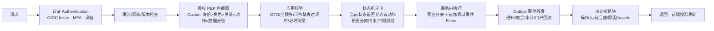

# 技术路线与系统架构方案 v0.1

- 日期：2026-09-22
- 性质：研发启动前的技术纲领（产品/技术决定，非既成事实）；与《PLATFORM_PRODUCT_V2》《GP4 核心对象与状态机》《高保真 v1.3》配套。
- 阅读对象：技术负责人、架构评审、首批工程师、合规/法务对接人。
- 标记约定：**【决定】**=本方案给出的技术选型默认；**【权衡】**=备选与放弃理由；**【门】**=依赖 D1–D9/Q6 拍板，未落定前按保守方案实现。

---

## 1. 技术目标与约束（从业务红线反推）

本系统不是内容展示站，而是一套**带强合规闸门的交易与作业系统**。技术路线首先服务于以下不可协商的约束：

1. **闸门服务端强制**：主体三要素、T0 时限升级、授权范围、家庭授权、门户越权、佣金六态、禁表述词库——前端隐藏不算控制，每个动作在服务端按"身份 × 业务关系 × 动作 × 数据分级"逐项校验（GP4 不变量 3/5/6/7/8）。
2. **状态不可静默改写**：全部业务状态以事件追加（Event Sourcing 思想），更正=更正事件，保留原值、原因、操作人；审计日志独立存储、哈希链防篡改。
3. **费用与金额零容错口径**：多币种分列、快照锁定、"待确认≠0"、不跨币种合计——由类型系统与数据库约束共同保证，不靠人自觉。
4. **L3 高敏数据最小可见**：证件/资产/家庭材料默认不可见，访问需授权、审批、水印、留痕；跨境共享单独同意 + 法定路径【门 D9】。
5. **一个后台控制两个终端 + 门户**：客户端所有内容（项目、费用、素材、问卷、通知模板、开关、数据源）由后台配置驱动、版本化、双人复核发布；不存在"写死在 App 里的业务内容"。
6. **影子运行先行**：V1 先内部影子运行 + 邀请制试点，架构必须支持"只读观察、灰度开关、一键下架、全程回放"。
7. **小团队可交付、可招聘、可运维**：首期 3–8 名工程师量级，避免过早微服务化；但模块边界按未来 V1.5/V2 平台化预留。

非功能目标（影子/试点期）：核心交易链路可用性 99.5% 起步；页面与接口 P95 < 1.2s（国内主流网络）；RPO ≤ 15 分钟、RTO ≤ 4 小时；全部管理操作可审计、可回放。

---

## 2. 技术选型总览（一句话版本）

**【决定】TypeScript 全栈单仓库（monorepo）：React Native 一套代码出客户端/顾问手机/iPad，React 出总后台与服务方门户，NestJS 模块化单体出后端，PostgreSQL + 事件表为事实源，对象存储/KMS 隔离 L3，Casbin 做关系型授权，哈希链审计，BullMQ 驱动 T0 送达升级，阿里云境内部署，Playwright 把 AT19–AT26 变成可执行验收。**

| 层 | 选型（默认） | 关键备选 | 选择理由 / 放弃了什么 |
| --- | --- | --- | --- |
| 手机端（客户+顾问+iPad） | React Native 0.7x + TypeScript，React Navigation，Reanimated 3 / Gesture Handler，FlashList，TanStack Query | Flutter；原生双端 | RN 可与 Web/后端共享 TS 的类型、状态机守卫、校验与禁表述词库（红线只维护一份）；Reanimated 可实现 v1.3 的弹簧转场/分层入场；iPad 用响应式大屏布局。Flutter 动效与一致性更强，但状态机/校验要再实现一遍，小团队代价大；原生双端招聘与翻倍成本不划算。 |
| 平板形态 | 同一 RN 工程，按尺寸分导航（iPad 三栏/客户演示模式） | 独立 iPad 工程 | 顾问 iPad 是同一批人、同一套数据，不另立工程；客户演示模式是"同一 App 的受限模式"，靠服务端下发的可见性策略实现，不是另一套代码。 |
| 后台 / 门户 Web | React 18 + Vite + TypeScript，Tailwind + 自研组件（设计 token 共享），TanStack Query/Table/Router，ECharts | Ant Design Pro；Vue | 高保真 v1.3 是定制的西方简洁视觉，AntD 默认观感与交互不符且深度定制成本高；表格密度用 TanStack Table 自建。后台不追求花哨，组件以"高效、密、可扫读"为准。 |
| 后端 | NestJS（模块化单体）+ TypeScript，Prisma（类型安全的数据库访问） | Spring Boot（Java）；Go 微服务；微服务全家桶 | 端到端同一语言，状态机/金额/禁表述校验在 `packages/` 只写一份、前后端共用；Nest 的模块/守卫/拦截器天然对应"闸门"；单体先跑通，模块按限界上下文切分，未来可按模块抽服务。放弃微服务：小团队、无高并发、跨服务事务/审计一致性代价远大于收益。Spring Boot 在合规人才市场上更强，若团队以 Java 为主可整体平移，架构边界不变（见 §11 平移说明）。 |
| 数据库 | PostgreSQL 15+（主库，JSONB 存版本快照，行级安全 RLS 辅助数据范围） | MySQL | 事务、JSONB（费用/合同/问卷快照）、RLS（按关系/机构过滤行）、成熟的约束体系；金额用 `numeric` 多币种分列，禁止 float。 |
| 缓存/队列/锁 | Redis（缓存、幂等锁、限流）+ BullMQ（定时任务、T0 升级、通知重试、到期回收） | RabbitMQ/Kafka | 试点期队列量级小，BullMQ + Redis 足够且运维简单；事件量级增长后审计/事件流可再挂 Kafka，不影响业务代码。 |
| 文件/证件（L3） | S3 兼容对象存储（阿里云 OSS）+ KMS 信封加密 + 独立桶 + 短时预签名 URL；门户走"受控阅读器"（服务端渲染水印、禁下载） | 文件直接入库/本地盘 | L3 与业务库物理分桶、最小权限；下载/原件为独立审批动作，门户端不落地原文件（GP4 §11/§13）。 |
| 身份认证 | OIDC：员工端 Keycloak（自建，MFA/动态码）；C 端手机号验证码 + 微信/Apple 登录；门户账号独立 realm 并绑定机构 | Authing/飞书身份 | Keycloak 可控、可私有化、支持 MFA 与联合身份；若希望免运维可换 Authing 等合规 IdP，接口不变。门户账号严格按 ServiceProvider 隔离。 |
| 授权模型 | RBAC（岗位/角色）+ ABAC（关系与数据分级策略），策略引擎 Casbin；服务端统一 PEP 拦截器 | 仅角色表硬编码 | 本系统权限核心是"关系"（是不是这个客户的主责顾问、是不是该批次授权机构、是不是核验人≠发起人），纯角色表表达不了职责分离与四眼原则；策略集中、可测试、可审计。 |
| 审计 | 独立审计库/账号，只追加；审计记录哈希链（前一条 hash + 内容），每日归档对象存储 Object Lock（WORM） | 普通操作日志表 | 合规卖点与监管检查要求"改不了、删不掉、可回放"；业务库 DBA 不应有审计库写删权限。 |
| 接口风格 | REST + OpenAPI 3.1，代码生成 TS client；错误码统一 | GraphQL；tRPC | 门户 B2B/未来开放平台需要稳定对外契约；OpenAPI 可做契约测试与文档；GraphQL 在此类强流程/强授权场景收益低、权限面大。 |
| 电子签/合同 | 【门 D2/D8】对接 e签宝/法大大（境内主体合同）；线下/境外签署走"受控登记 + 五要素核验"，不做线上代签 | 自建电子签 | 电子签是持牌合规服务，不自研；未拍板前合同模块只做登记与核验流。 |
| 支付 | 【门 D8】V1 按推荐：线下对公转账 + 凭证上传 + 财务双人核验，**不做资金托管/直连支付**；二期再评估支付通道（境内聚合/跨境收款） | 一上来接支付/托管 | 资金路径是最高合规风险，推荐方案已在 D1–D9 手册；技术上预留 PaymentGateway 抽象，通道后装。 |
| 通知通道 | App 推送（国内厂商通道聚合：个推/极光或 APNs+FCM 海外）、短信（阿里云/腾讯）、邮件（企业邮箱/ SendGrid 类）；DeliveryRecord 统一回执 | 单一通道 | T0 要求多通道 + 失败换道 + 人工电话结果登记，通道必须可插拔。 |
| 签证/护照数据 | 【门 Q6】服务端代理第三方授权 API（IATA Timatic 类或合规聚合商），授权开关 + 缓存节拍 + 署名 + 失效自动下架；客户端不直连 | 爬虫/无授权数据 | 专有数据必须授权；未授权只保留框架与示例，A01 数据源开关控制对客可见性。 |
| OCR/实名辅助 | 云厂商 OCR（材料质检/字段预填）+ 实名认证（人脸/三要素按需）；结果只作辅助、人工核验为准 | OCR 自动通过 | 移民材料判定必须人工/持牌方负责，OCR 不产生官方状态。 |
| 部署/云 | 阿里云（北京等境内区域）：VPC、ACK（或 ECS+compose 起步）、RDS、OSS、KMS、SLB/WAF、堡垒机、日志服务 SLS；境外访问通过反向代理 + 受控阅读器，不在境外放 L3 数据 | 境外开服直接放 L3 | 【门 D9】跨境数据法定路径确认前，L3 不出境；门户是"只看不落地"。 |
| CI/CD 与质量 | Gitee（代码主仓）+ Gitee Go/Jenkins；Docker；环境 dev→test→staging（影子）→prod；PR 门禁：类型检查、单测、契约测试、Playwright E2E、安全扫描 | 手工发布 | 闸门类系统必须自动化回归；AT19–AT26 全部转成 E2E 用例，红线回归不过不允许合并。 |
| 可观测 | SLS/ELK 结构化日志 + OpenTelemetry 链路 + Sentry 异常 +  uptime 拨测；日志脱敏（证件号/账号掩码） | 打印日志 | L3 禁止进明文日志；每条 T0/支付/授权操作有 traceId 可串联。 |

---

## 3. 总体架构

### 3.1 五端与服务分层（容器视图）

```mermaid
flowchart TB
  subgraph 终端
    C[客户端 App\nReact Native\n浏览/初评/方案/订单/案件/全球通行/工单]
    A[顾问展业端 App\nReact Native\n手机 5 tab + iPad 双模式]
    W[总后台控制台\nReact Web\nA01–A12 运营/合规/财务]
    P[服务方受控门户\nReact Web\n只读/水印/批次/报告]
  end
  subgraph 接入层
    GW[API 网关 / BFF\n鉴权 · 限流 · 灰度开关 · 设备与版本 · 审计入口]
  end
  subgraph 业务服务（NestJS 模块化单体，按限界上下文分包）
    M1[身份与关系 IAM\n账号/人员/顾问资质/服务关系/家庭授权]
    M2[内容与项目\n项目版本/核验/收费/发布/数据源/素材词库]
    M3[交易\n初评/方案/订单/主体校验/合同登记/付款收据/退款]
    M4[交付\n案件/任务T0/材料/事件四级来源/门户批次]
    M5[通知与工单\n模板/多通道送达/升级链/工单投诉合规]
    M6[佣金与结算\n规则快照/六态/双人复核/冻结调整]
    M7[审计与配置\n审计哈希链/特性开关/内容配置/数据字典]
  end
  subdir[数据与基础设施]
    PG[(PostgreSQL\n业务+事件+审计链)]
    RDS[(Redis\n缓存/队列/锁)]
    OSS[(OSS 分桶\nL3 文件 · 水印 · WORM 归档)]
    KMS[(KMS 信封加密)]
    EXT[外部：电子签 · 短信/推送/邮件 · OCR/实名 · 签证数据源 · 支付(后装)]
  end
  C-->GW; A-->GW; W-->GW; P-->GW
  GW-->M1 & M2 & M3 & M4 & M5 & M6 & M7
  M1 & M2 & M3 & M4 & M5 & M6 --> PG
  M1 & M2 & M3 & M4 & M5 & M6 --> RDS
  M4-->OSS; M1-->OSS; M7-->OSS
  M2 & M3 & M4 & M5-->EXT
  KMS-.加密.-OSS
  KMS-.字段级.-PG
```

### 3.2 一次请求如何穿过"闸门"（强制管线）

所有写操作（以及 L2/L3 读操作）统一经过下列管道，任何一环失败即拒绝并审计：



要点：
- **前端没有任何"放行权"**：按钮置灰只是体验，服务端 PEP + FSM 是唯一裁决；门户/顾问端越权请求返回 403 并写审计（AT20/AT25）。
- **职责分离在 FSM 层硬编码**：核验人≠案件发起人、编辑≠核验≠发布、结算双人复核、财务不见原件、投诉调查人≠被投诉顾问（GP4 不变量 7）。
- **主体三要素门**是订单聚合内的不变量校验：签约主体、境外交付方、收款户名任一不一致，订单状态停在"阻断"，四个入口（客户下单/付款、顾问发起、财务核验）共享同一判定，无强制通过参数（AT21）。

### 3.3 状态机与事件溯源的落地方式

不引入重型 EventStore 框架，用 PostgreSQL 即可获得 80% 收益：

- 每张聚合根表（orders / cases / proposals / authorizations / commissions / tickets / portal_grants / consents…）配一张 `<agg>_events` 表：`id, agg_id, type, from_state, to_state, payload(JSONB), actor, actor_role, reason, created_at, prev_event_id`。
- 当前状态与高频查询字段存主表（投影），由事务内 reducer 维护；事件只追加、不更新、不删除。
- 状态迁移规则集中在 `packages/core`（纯函数 TS）：`canTransition(state, event, context)` 与 `reduce(state, event)`，**后端 NestJS 与移动端离线/演示逻辑共用同一份**；迁移表即文档、即测试、即验收。
- 更正操作 = `*.corrected` 事件，payload 带原值/新值/原因/审批人；时间线永久保留（GP4 §通用约定、V2 §9）。
- Outbox 模式：业务事务与 outbox 行同事务提交，BullMQ worker 轮询外发（通知、佣金应计、门户到期回收、审计归档），保证"状态变了通知一定发得出"，不依赖分布式事务。
- 佣金六态、授权五步、T0 升级链、门户批次到期等**时间驱动迁移**由调度器扫描到期事件生成，禁止人工直接改状态字段。

### 3.4 后端模块（限界上下文）划分

| 模块 | 聚合/实体（对应 GP4） | 关键闸门 | 对应后台 |
| --- | --- | --- | --- |
| iam（身份与关系） | Customer/Person/Advisor/Credential/Relationship/Consent/PortalAccount | 双向关系、一名主责、家庭授权逐项校验、资质到期停新接旧 | A03/A04/A10 |
| catalog（内容与项目） | Project/ProjectVersion/VerificationRecord/FeeScheduleVersion/ShareAsset/DataSourceAuth/禁表述词库 | 无核验不发布、编辑≠核验≠发布、改价出新版、词库四生产点统一 | A01/A12/A11 |
| transaction（交易） | Assessment/Proposal/Order/PaymentPlan/Payment/Receipt/ContractRegistration | 快照锁定、主体三要素、多币种不相加、待核验≠到账、合同五要素 | A07（交易侧） |
| delivery（交付） | Case/Task/Material/CaseEvent/ServiceProvider/PortalGrant | 四级来源、sp≠off、无凭据不发布官方节点、T0、门户只读/水印/到期回收 | A05/A06 |
| engagement（通知与工单） | Notification/DeliveryRecord/Ticket/Complaint/ComplianceEvent | T0 多通道换道升级不改期、投诉回避、锁屏脱敏 | A08/A09 |
| settlement（佣金结算） | Commission/CommissionRule（版本快照）/Settlement | 六态不跳步、点击咨询不产生、异币种不合并、双人复核、冻结不连坐 | A07（佣金侧） |
| governance（审计与平台配置） | AuditLog/FeatureFlag/ContentConfig/RolePolicy/数据字典 | 哈希链、最小权限、前后端内容开关、影子模式 | A10/A11/控制矩阵 |

模块间只允许通过 service 接口/事件通信，不允许跨模块直接读对方表（用数据库 schema 物理隔离 + lint 规则约束），为未来抽服务留边界。

### 3.5 数据分级与存储隔离

| 分级 | 数据 | 存储与访问策略 |
| --- | --- | --- |
| L1 公开 | 已发布项目、名片白名单字段、防骗教育、核准素材 | CDN 缓存 + 后台版本化发布；下架即历史只读 |
| L2 业务 | 方案、订单、工单、跟进、佣金（顾问仅本人） | 主库；按关系/岗位行级过滤；内部备注不对客投影 |
| L3 高敏 | 证件影像、资产证明、家庭/监护材料、无犯罪、合同、付款凭证 | 独立加密桶 + KMS 信封加密；证件号字段级加密/掩码；日志禁明文；默认只见"状态"不见原件；查看走授权/审批并生成水印视图；下载单独审批、限时、留痕；门户不落地 |

跨境（【门 D9】）：法定路径（标准合同/安全评估，以律师意见为准）确认前，境外服务方仅能通过受控门户在线查看带水印影印件，不能批量导出；跨境共享 Consent 独立勾选、清单最小化、可一键撤回并回收所有批次授权。

---

## 4. 前端架构要点

### 4.1 移动端（RN，单工程双 App）

- 一个 RN 工程、两个 target/bundle：**客户版**与**顾问版**（图标、包名、功能集不同；共享设计系统与核心逻辑）。顾问版内部再按设备尺寸切"手机 5 tab"与"iPad 三栏 + 客户演示模式"。
- 导航：React Navigation（Native Stack + Bottom Tabs）；转场用 v1.3 规范：推进 420ms 带轻微缩放、返回分层、弹簧按压；Reanimated 驱动，60fps、不走 JS 线程动画。
- 数据：TanStack Query（服务端状态）+ 少量 Zustand（会话/本地 UI 态）；乐观更新只用于非闸门动作（如草稿、已读），**所有闸门动作以服务端响应为准，不做乐观通过**。
- 表单：react-hook-form + zod；zod schema 由 OpenAPI 生成后扩展，金额/币种/禁表述在客户端先拦一道（体验），服务端再拦（裁决）。
- 安全：App 内不存 L3 原件缓存（只存服务端渲染的水印视图/缩略图）；token 存 Keychain/Keystore；越狱/Root 提示；屏幕防截屏在案件材料页按策略开启（Android 可强制、iOS 仅提示+遮罩）；顾问端支持远程登出与设备管理。
- 演示模式（iPad 对客）：同一 App 的受限会话，服务端下发"脱敏字段投影 + 仅 A12 核准素材"，切换写审计（AT25 红线⑤）。
- 分发：国内 Android 各厂商市场 + 华为/小米/OPPO/vivo；iOS App Store（注意移民类 App 的审核材料与 IAP 边界——服务是线下签约的 B2C 专业服务，数字内容售卖规则需合规确认）；顾问版可走企业 MDM/TestFlight 先行。

### 4.2 Web（总后台 + 门户）

- 同一 React 设计语言两套壳：后台为左侧导航 + 高密度表格 + 双栏复核；门户为受控窄功能（4 页签），严禁出现超范围入口。
- 后台所有配置类操作走"草稿 → 复核 → 发布"流，发布带版本号与 diff 视图；危险操作二次验证 + 原因必填。
- 门户水印：登录用户标识 + 机构 + 时间，SVG/Canvas 对角平铺；受控阅读器禁用右键/拖拽/复制（体验层）+ 服务端不提供原始 URL（预签名 2 分钟、逐页渲染）+ 下载审批通过后才生成带水印 PDF（AT25）。
- 浏览器兼容：最近两个大版本 Chrome/Edge/Safari；不支持 IE。

### 4.3 设计系统工程化（让 v1.3 不白做）

- `packages/ui`（Web）与 `packages/ui-native`（移动）共享同一批 **design tokens**（颜色/圆角/间距/动效曲线/时长，直接从设计系统 v1.1 第 11 章落成 JSON/TS）。
- 高保真 HTML 是视觉契约：组件开发后用 Playwright/截图比对逐屏验收；先做"组件清单 → 页面模板 → 业务页面"，不逐屏重画。
- 动效默认值（按压 130–180ms、入场 420–550ms、渐变 16s、脉冲 1.8s）与 reduced-motion 兜底写进 token 与组件，不允许页面自定义魔数。

---

## 5. 安全、合规与审计

1. **账户与访问**：员工 MFA + 强密码 + 会话超时 + IP 白名单（可选）；最小权限按岗位模板，权限变更双人审批；离职自动回收。
2. **职责分离（SoD）**：在 Casbin 策略与 FSM 双层表达（编辑/核验/发布、发起/核验、结算复核、投诉回避），冲突时服务端拒绝并审计。
3. **审计链**：关键域（登录、授权、状态变更、金额、L3 访问/下载、门户批次、后台配置发布、模式切换）100% 入哈希链；客户侧"访问与授权记录"是同一审计库的脱敏投影。
4. **加密**：传输 TLS1.2+；存储 OSS SSE-KMS + 信封加密；证件号/银行卡号字段级加密；KMS 密钥轮换与权限分离（开发/运维不可触达生产密钥）。
5. **隐私（PIPL/841 号令）**：【门 D9】隐私政策、单独同意清单、PIPIA、数据保留与删除规则在开放前成文；家庭授权、跨境共享、营销订阅分别独立同意；撤回即时生效并回收门户授权。
6. **内容合规**：禁表述词库（成功率/包过/内部渠道等）在初评结论、方案、顾问讲解素材、分享内容四个生产点服务端校验，命中阻断并提示；超模板话术人工署名审核（AT23）。
7. **防欺诈**：主体不一致反复提交、非常用地登录、批量越权尝试、凭证重复提交触发风控事件；私收款线索自动建 ComplianceEvent。
8. **备份与容灾**：RDS 自动备份 + 跨可用区；每日逻辑备份加密异地存储；每季度恢复演练；WORM 审计归档独立保留（保留期待法务定，默认业务关系结束后不少于法定年限）。
9. **供应链安全**：依赖锁版本 + 漏洞扫描（pnpm audit/SCA）、镜像扫描、最小化基础镜像、秘钥只进 KMS/秘钥管理不进仓库（Gitee 历史中已出现的令牌必须在启用前轮换——见 §10 行动项）。

---

## 6. 环境、部署与研发流程

- 环境：`dev`（本地/测试数据）→ `test`（集成 + E2E）→ `shadow`（影子环境，接真实-ish 数据、只内部看）→ `prod`（邀请制灰度）。
- 发布：
  - 后端：容器镜像，蓝绿/灰度（按员工/顾问/客户白名单放量）；数据库变更用 Prisma Migrate，迁移向后兼容、先扩展后收缩。
  - 内容（项目/费用/模板/词库/开关）：后台发布即生效，带版本与回滚，不随 App 发版。
  - App：特性开关（远程配置）控制新模块可见性；全球通行等未授权模块开关默认关闭。
- 分支：trunk-based，`main` 保护，PR 必需：CI 全绿 + 一人评审（闸门/金额相关需两人）+ E2E 通过；tag 与变更记录。
- 质量金字塔：
  - 单测：状态机/reducer、金额与多币种、授权策略、禁表述词库（100% 覆盖核心纯函数）。
  - 集成：每个闸门的正反路径（如主体不一致四入口全关闭、门户到期回收、T0 换道）。
  - E2E（Playwright Web + Maestro/Detox RN）：AT19–AT26 与高保真主链路逐场景。
  - 契约：OpenAPI + Prism mock，前后端并行开发。
- 数据：三套数据严格分离——**示例数据（带【示例】水印标识，只能进 dev/test）**、影子数据（真实流程练习、不对客）、生产数据；提供 seed 脚本但生产初始化不带任何示例内容。

---

## 7. 工程结构（monorepo）

```
transparent-identity-platform/        # 即现有 Gitee 仓库，05-代码/ 为根
├── apps/
│   ├── client-app/                   # React Native 客户版
│   ├── advisor-app/                  # React Native 顾问版（手机+iPad，含演示模式）
│   ├── admin-web/                    # 总后台 React
│   └── partner-portal/               # 服务方门户 React
├── services/
│   └── api/                          # NestJS 模块化单体（iam/catalog/transaction/delivery/engagement/settlement/governance）
├── packages/
│   ├── core/                         # 状态机迁移表/reducer、金额多币种、禁表述、AT 规则（前后端共用）
│   ├── api-contract/                 # OpenAPI 源 + 生成的 TS client/types
│   ├── ui/                           # Web 组件（tokens 对齐设计系统 v1.1）
│   ├── ui-native/                    # RN 组件
│   ├── icons/                        # 内联 SVG 图标库（与高保真同源）
│   └── config/                       # 环境配置/特性开关类型
├── infra/                            # docker-compose、数据库迁移、部署脚本、IaC
├── e2e/                              # Playwright（Web）+ Maestro（App）
└── docs/ ->  ../01-产品规划 ../02-功能设计 ../04-UI设计 的索引
```

依赖与工具：pnpm workspaces + Turborepo；Node 20 LTS；统一 ESLint/Prettier/tsconfig strict；提交信息约定化（便于自动变更日志）。

---

## 8. 研发路线（与产品三阶段对齐）

> 粗粒度 T 恤尺码，用于排序与人员规划；具体人天在 PRD 逐模块切片后给出。每阶段都必须"闸门先行、演示数据可跑、红线用例先红后绿"。

| 里程碑 | 内容 | 出口标准（可演示/可验收） |
| --- | --- | --- |
| **M0 地基（2–4 周）** | monorepo、CI/CD、四端骨架、OIDC 登录（员工+客户+门户三类）、Casbin、审计哈希链、设计 token 落库、示例/影子数据机制 | 四类账号登录；越权访问被拒且入审计；高保真首页在 RN/Web 用真组件还原 |
| **M1 内容与初评（3–5 周）** | A01 项目版本/核验/收费/发布四眼流、A12 素材与词库、客户端浏览/项目详情/初评四结果、顾问授权五步（学习→确认→申请→审核→绑定） | 无核验不可发布；未授权顾问锁报价；词库命中阻断；客户端内容 100% 后台可控 |
| **M2 方案与交易（4–6 周）** | 方案版本化与复核、订单三态、主体三要素门、合同受控登记/电子签预留、付款凭证核验与收据、退款冻结 | ORD-2409-018 类反例四入口全关闭；改价出新版、旧单锁快照；AT07/08/21 全绿【门 D2/D4/D8】 |
| **M3 交付与门户（5–7 周）** | 案件/任务/材料、四级来源时间线、T0 多通道与升级链、家庭授权、服务方门户（批次/水印阅读器/报告提交/资质）、iPad 双模式 | AT19/20/22/25 全绿；门户到期自动回收；sp≠off；T0 短信未达自动转人工且不改截止 |
| **M4 保障与结算（4–6 周）** | 工单/投诉/合规事件（回避）、通知模板与送达回执、佣金六态与双人结算、控制矩阵、A10/A11 补齐、影子运行看板 | AT23/24/26 全绿；投诉对被投诉人不可见；佣金不可跳步；后台可控制前端全部内容 |
| **M5 开放准备（3–4 周）** | 安全测试/等保评估配合、隐私合规交付物、数据保留删除、灰度与邀请制、运营 SOP、签证数据源接入（若 Q6 落地） | 影子运行报告 + 灰度开关 + 回滚演练；全球通行随授权开关上线，否则保持框架 |

关键路径：**M0 审计/IAM → M1 发布闸门 → M2 主体门与资金 → M3 T0/门户**。D1–D9 中 D2（主体与备案）、D8（资金路径）、D9（跨境数据）是 M2/M3 的硬前置；Q6 只影响全球通行，不阻塞主线。

---

## 9. 主要风险与技术对策

| 风险 | 影响 | 对策 |
| --- | --- | --- |
| D2/D8/D9 迟迟不拍板 | M2/M3 无法对客 | 合同/支付/跨境全部以"接口 + 受控登记 + 开关"抽象，先通内部影子流；决策落定后只替换实现，不返工状态机 |
| 小团队全栈面铺太大 | 交付失控 | 严格按 M0–M4 顺序；门户与 iPad 演示模式复用同一套授权/投影；后台 CRUD 由代码生成 + 复核流模板化 |
| RN 动效达不到 v1.3 预期 | 体验落差 | M0 做动效 Spike（转场/渐变/脉冲/Tab 胶囊各一个），不达标即评估 Flutter 重写移动层（Web/后端不受影响） |
| L3 泄露（截图/下载/越权） | 合规事故 | 不见原件默认、水印、预签名、审批、审计链五件套；门户端不落地；安全测试覆盖 IDOR/越权枚举 |
| 第三方依赖（电子签/短信/OCR/签证数据） | 进度与可用性 | 全部走适配器接口 + 可切换供应商；签证数据无授权不上线（Q6） |
| 审计/事件表膨胀 | 性能与成本 | 事件按月分区、冷数据归档 WORM；审计查询走独立只读副本/检索，不压业务库 |
| 应用商店审核（移民/签证类） | 上架受阻 | 提前准备资质与服务说明；顾问版先走企业分发/TestFlight；客户端不出现成功率承诺与违规词 |
| 历史令牌泄露 | 仓库/账号风险 | 启用生产前轮换 Gitee 令牌与所有秘钥；令牌改走秘钥管理，仓库接入 secret scanning |

---

## 10. 立即行动项（PRD 与开工之间）

1. 本方案评审会：确认/调整选型（特别是 RN vs Flutter、NestJS vs Spring Boot 两个大项）。
2. 开通与隔离：云账号、代码仓分支保护、包管理私源、KMS、对象存储分桶、IdP  realm 规划。
3. **轮换此前在会话中出现过的 Gitee 私人令牌**；今后令牌只通过秘钥管理下发，禁止入仓/入截图。
4. 把 GP4 的状态迁移表整理为 `packages/core` 的机器可读清单（状态/事件/守卫/角色/审计级别），它同时是 PRD 验收用例的骨架。
5. 研发级 PRD 按 M1→M4 顺序逐模块产出（字段、接口、状态、异常、验收、埋点），每篇 PRD 对应一次 E2E 用例评审。
6. D2/D8/D9 律师与支付/电子签供应商预沟通并行启动，避免 M2 等待。

---

## 11. 若团队以 Java 为主：等价平移说明

整体架构与模块边界不变，仅替换实现：后端换 Spring Boot 3（Spring Security + 资源服务器对接 OIDC、Casbin 换内置 ABAC/Open Policy Agent、Prisma 换 MyBatis-Plus/JOOQ、BullMQ 换 XXL-JOB/RocketMQ）；`packages/core` 的状态机/金额/禁表述纯逻辑用 Java 重写为独立 lib，移动端通过 OpenAPI 生成的 client 保持契约一致；事件表、审计哈希链、RLS 思想（换视图/权限策略）完全保留。选型决策建议在 M0 前一次性定死，避免中途切换。
